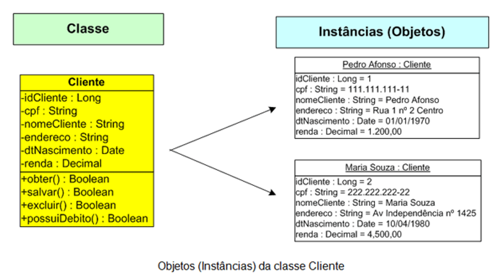
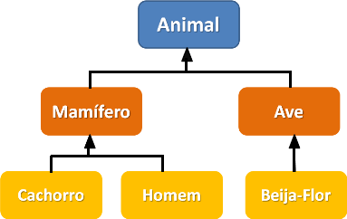
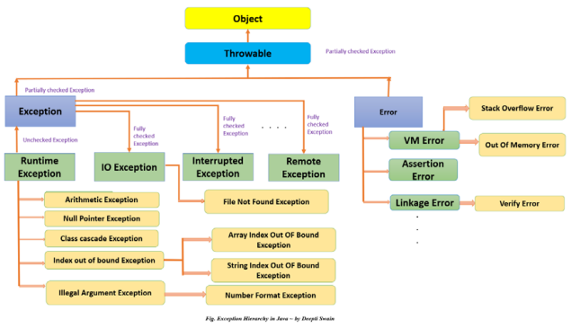
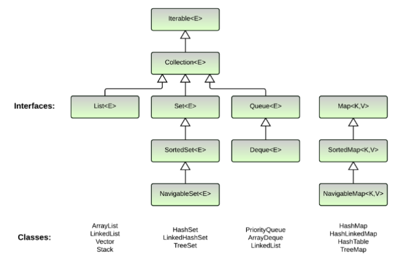

Durante as aulas de Back-End do curso Afrocódigos, estudamos como a linguagem Java e a Programação Orientada a Objetos (POO) são essenciais na preparação dos alunos para enfrentar desafios reais do mercado de trabalho. Ao abordar esses tópicos, o curso proporciona uma compreensão sólida dos conceitos fundamentais de programação e aplicá-los em cenários práticos do cotidiano de desenvolvedores. Um exemplo é o Projeto Guiado para a construção de um sistema de operações de uma loja.

[Repositório GitHub : TB-Java-Projeto-Guiado-I](https://github.com/hugomacielads/TB-Java-Projeto-Guiado-I)

Durante o curso, os participantes são expostos ao conceito de Programação Orientada a Objetos (POO), que é uma abordagem de programação que organiza o código em objetos interativos. Essa metodologia permite criar sistemas mais modularizados, flexíveis e de fácil manutenção. Os alunos aprendem a desenvolver cenários hipotéticos utilizando os princípios da POO, interagindo com usuários e aplicando conceitos como herança e polimorfismo.

Logo abaixo detalhei os principais tópicos estudados durante as aulas de programação em Java.

**Compilador**
- O compilador é responsável por traduzir o código-fonte escrito em uma linguagem de programação para uma linguagem que a máquina possa entender (geralmente linguagem de máquina). 
- No caso do Java, o compilador traduz o código-fonte para bytecode, que é executado pela Máquina Virtual Java (JVM).

**Fortemente tipado**
- Java é uma linguagem fortemente tipada, o que significa que cada variável deve ser declarada com um tipo de dados específico.
- Isso ajuda a evitar erros, como tentar realizar operações incompatíveis com o tipo de dados da variável.

**Variáveis**
- As variáveis são usadas para armazenar valores que podem ser usados e alterados posteriormente no programa. 
Elas são fundamentais para a programação, pois permitem que os programas sejam dinâmicos e flexíveis.

**Estruturas de condição**
- As estruturas de condição (como if, else, switch) permitem que o programa tome decisões com base em certas condições.
- Isso permite que o programa execute diferentes blocos de código dependendo do estado do programa.

**Estruturas de repetição**
- As estruturas de repetição (como for, while, do-while) permitem que um bloco de código seja repetido várias vezes.
- Isso é útil para tarefas como percorrer arrays ou repetir uma ação até que uma condição seja atendida.

**Arrays**
- Arrays são usados para armazenar vários valores de um mesmo tipo em uma única variável.
- Eles são úteis quando você precisa trabalhar com muitos valores relacionados.

**POO**
- A POO é um paradigma de programação que usa objetos e classes para estruturar o código de maneira mais intuitiva e flexível. Isso inclui conceitos como:



1. **Classes**: As classes são os “planos” para criar objetos. Elas definem os atributos e métodos que um objeto terá.
2. **Métodos**: Os métodos são funções definidas dentro de uma classe. Eles definem o comportamento dos objetos criados a partir da classe.
3. **Atributos**: Os atributos são as variáveis definidas dentro de uma classe. Eles representam o estado de um objeto.
4. **Construtor**: O construtor é um método especial usado para inicializar um objeto quando ele é criado.
5. **Getter e Setter**: Os métodos getter e setter são usados para acessar e modificar os atributos de um objeto, respectivamente.

**Escopo de variáveis**
	1. **Variáveis de instância**: São declaradas na classe, mas fora de qualquer método. Elas são criadas quando um objeto é criado com a palavra-chave new e destruídas quando o objeto é destruído.
	2. **Variáveis de classe (static)**: São declaradas na classe, fora de qualquer método, com a palavra-chave static. Elas são criadas quando o programa começa e destruídas quando o programa para.
	3. **Variáveis locais**: São declaradas dentro de um método, incluindo parâmetros de método. Elas são criadas quando o método é invocado e destruídas quando o método termina.
	4. **Variáveis de bloco**: São declaradas dentro de um bloco de código definido por chaves {}. Elas são criadas quando o bloco de código é executado e destruídas quando o bloco de código é deixado.

**Herança**
- A herança permite que uma classe herde atributos e métodos de outra classe.
- Isso permite o reuso de código e a criação de hierarquias de classes. 
- O uso do super() permite acessar métodos e atributos da classe pai.

```
public class Ave extends Animal {}
```

**Encapsulamento**
- O encapsulamento é o conceito de esconder os detalhes de implementação de uma classe e permitir o acesso apenas através de métodos públicos.
- Isso é geralmente feito usando modificadores de acesso (private, protected, public).
    1. **Private**: O membro é acessível apenas dentro da mesma classe. Não é visível para classes no mesmo pacote ou subclasses.
    2. **Protected**: O membro é acessível para todas as classes no mesmo pacote e todas as subclasses, independentemente do pacote.
    3. **Public**: O membro é acessível para todas as classes em todos os pacotes.
    4. **Default**: O membro é acessível para todas as classes no mesmo pacote. Não é visível para classes em pacotes diferentes ou subclasses em pacotes diferentes.
- Criar os atributos como protected e utilizar os métodos public para acessar(get) e modificar(set) para acesso fora da instância (main).
	
**Polimorfismo**
- O polimorfismo permite que um objeto seja tratado como uma instância de sua própria classe ou de qualquer classe de sua hierarquia de herança.
- A sobrecarga de construtores é um exemplo de polimorfismo, onde vários construtores podem ser definidos com diferentes parâmetros.

**Classes Abstratas**
- As classes abstratas são classes que não podem ser instanciadas e são geralmente usadas como classes base para outras classes.
- Se a classe for abstrata e tenha um método abstrato, então obrigatoriamente as classes filhas precisarão implementar o método.



- Indicação do static no método da classe abstrata significa que ela receberá ou não parâmetros, poderá ser modificado ou não.
    1. **Polimorfismo Dinâmico**: Permite inserir novos parâmetros na classe filha (Uso do @Override sinalizando reescrita do método)
    2. **Polimorfismo Estático**: Não permite
	
**Exceções**
- As exceções são usadas para lidar com erros e situações excepcionais que podem ocorrer durante a execução de um programa. 
- As exceções podem ser supervisionadas (checked), o que significa que o compilador exige que elas sejam tratadas, ou não supervisionadas (unchecked), o que significa que o tratamento é opcional


	
**Interfaces**
- As interfaces são importantes na programação orientada a objetos porque permitem a separação de definição e implementação e podem ser usadas para alcançar o polimorfismo.
- Uma classe pode implementar várias interfaces, o que é especialmente útil em Java, pois não suporta herança múltipla de classes.
	
**Collections / Interfaces - Estruturas de dados**
- Java tem algo que é fundamental para o armazenamento e manipulação de informações em programas. 
- Essas estruturas de dados, juntamente com interfaces como List, Set e Map, facilitam a implementação de algoritmos e a organização de dados.
- É como uma definição de contratos que as classes devem seguir.



**Listas**
1. **ArrayList**(Lista Encadeada): Aponta apenas para o próximo elemento, insere no final (leitura em ambientes monothread).
2. **LinkedList**(Duplamente Encadeada): Aponta para o próximo e o anterior, insere em ambos (flexibilidade e mobilidade na inserção e remoção de elementos).
3. **Vector**(Lista Encadeada): Utilizado para multithread.
4. **Stack**(Pilha): O último elemento adicionado é o primeiro a ser removido.

**Set**
1. **Conjunto**(Set): Apenas valores únicos
2. **Hashset**: Não garante a ordem dos elementos armazenados, somente um elemento nulo.
3. **LinkedHashset**: Mantém a ordem de inserção dos elementos na coleção.
4. **TreeSet**: Armazenamento crescente em árvore binária com base em sua comparação natural.

**Map**
1. **Mapa**(Map): Chave-valor,  coleção que associa chaves únicas a valores correspondentes.
2. **HashMap**: Não garante a ordem das entradas tabela de dispersão para acesso rápido aos elementos.
3. **LinkedHashMap**: Mantém a ordem de inserção das entradas.
4. **TreeMap**: Armazena as chaves em ordem crescente. Permite consultar, adicionar e remover elementos em ordem.

Existem além das listas várias outras estruturas de dados.
